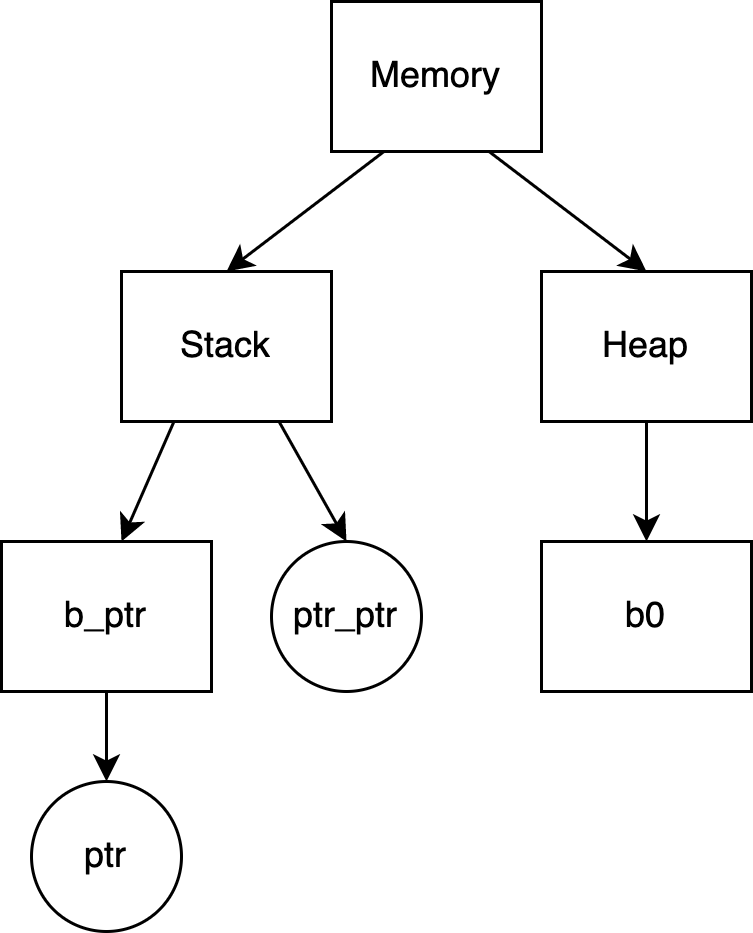
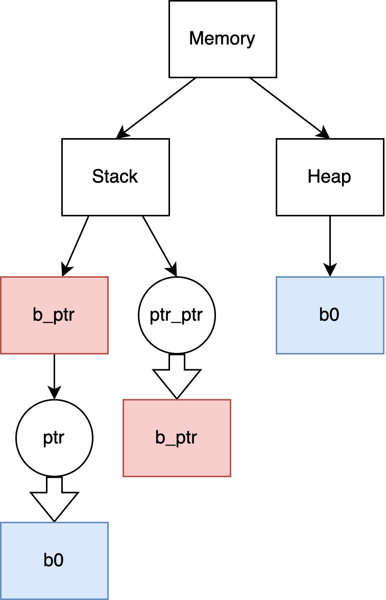

# Program State

## Description
This is a document regarding the portion of the program state relevant for the visualization component. [ProgramState.ts](./ProgramState.ts) provides these relevant parts. The final program state will track more information but are not of concern for the purpose of visualization implementation.

## Conceptual Model

There are 2 types of data structure of interest, pointers and blocks in our memory leak static analysis. Pointer is just a variable that potentially points to a memory block, where memory block is a continuous chunk of memory. Each pointer and memory block will have an identifier (`MemoryPointer.id` and `MemoryBlock.id`). All these top-level information is kept in the `ProgramState` interface, which only contains a complete mappings of ids to their corresponding blocks (`ProgramState.blocks`) or pointers (`ProgramState.pointers`).

It is assumed that every pointer id starts with `ptr`, while every block id starts with `b`. It might serve as a differentiator between the 2 types in some implementation scenarios.

With this in mind, there are several possible points of interest:

### Existence

A block might not always exist:
```C
if(something) {
	malloc(sizeof(int)); // call this block b_0
} else {
	malloc(sizeof(int * 2)); // call this block b_1
}
```
In this case, both `b_0` and `b_1` may exist (in our 3-state design, no way to track that at least one of them exist). The existence information is recorded in `MemoryBlock.existence`.

It is beneficial to visually indicate whether a block may exist or definitely exist, preferrably through some styling in its node in the tree. If a block definitely does not exist, it will not be in the program state so should never be rendered.

Note that this existence will not be a property for a pointer: if a pointer is in the program state, it definitely exists. If it gets out of scope, it is removed from the state.

The edge case for the existence of a pointer is if it is contained in a block that might not exist (for example, a pointer as a struct field, and the whole struct is allocated only on a conditional branch). But in that case, it is better to just indicate that the block that contains it might not exist, rather than indicating both to cause more confusion (have multiple possible interpretations). Therefore for visualization purpose, pointer nodes do not need styling differences to indicate status.

### Validity

This one applies to pointer only; although above it has been discussed that existence is not of concern for pointer, a pointer can be NULL, dangling or pointing to unknown address. This is a boolean kept in `MemoryPointer.canBeInvalid`. Control flow makes it so that we need to record it as a potential problem but not a definite one. Though it is easy to see that:

- If a pointer has `canBeInvalid = true` and has no pointing relations to any block at all, it is definitely an "invalid" pointer.

It is best if there is an indication in the visualization on the pointer node about whether it can possibly be invalid (but no need to differentiate between possibly/definitely visually, as that is apparent by observing on things it points to like described above).

### Container relation

There is a container relation: a block can contain a sub-block or a pointer:

```C
struct A {
	int id;
};

struct S {
	A a;
	S* s_ptr;
} s;
```

In this case, `s` (on the last line) of type struct `S` contains both another struct and a pointer. This is crucial in our analysis, as `free` on `s` should propogate through and remove/invalidate any relations down the hierarchy.

As long as the arrow used is visually different than the one used by the pointing relation, this is a viable thing to render to show the connection between nodes better.

For the sake of consistency (and easiness to render trees), assume that there is always a top-level block with id `b_memory` that represents the entire memory, which contains a `b_stack` block and a `b_heap` block.

For a block containing pointer relation, the information is kept in `MemoryBlock.contains` (container->containee) and `MemoryPointer.in` (containee->container). Every pointer must be contained in some blocks, whether it is the `stack` block, or some other memory blocks.

For a block containing block relation, the information is kept in `MemoryBlock.contains` (container->containee) and `MemoryBlock.in` (containee->container). Every block except the top-level block must be contained in some blocks (`b_stack`, `b_heap`, or some other blocks).

Do note that except the top-level `b_memory`, `b_stack` and `b_heap`, `MemoryBlock.contains` will record the list of items in ascending order, so in the struct example, it will record the block for `a` first, then the `s_ptr`. The first element in this list will have the same memory address as the container block itself.

### Pointing relation

```C
int *ptr = (int *)malloc(sizeof(int)); // call this block b0
```

The `malloc` call creates a memory block `b_0`, and assign the address to `ptr`.

Then we have the following 2 information recorded:
- `ptr` definitely points to `b_0`.
- `b_0` is definitely pointed to by `ptr`.
 
The positive direction (pointer->pointee) is kept in `MemoryPointer.pointsTo`. Due to control flow, a pointer might point to any of several blocks (exclusive or). So in this case, we have a list of blocks that the pointer can point to.

The negative direction (pointee->pointer) is kept in `MemoryBlock.in`. A block can be pointed to by multiple pointers simutaneously (inclusive or), each arrow with potentially different status. In this case, we also have a list of pointers that can point to the current block.

The pointing arrow in the visualization should preferrably have differentations for the "definitely" and "maybe" cases.

## Visualization Additional Notes

The above 4 points (2 unary ones, 2 binary ones) should be visually different (a legend can be added later). It is also suggested to give each node a unique color through some color randomization library, to allow easier identification of duplicating nodes (explained later).

The suggested approach to generate the data to feed into the tree renderer goes like this:
- Keep a record of every node that is rendered + its color.
- (container, existence, validity) Start from the root `memory` node: render all the blocks and pointer the block contains. Recursively do this (depth-first) purely on the "container" relation, but also render each block or pointer based on the "existence" and "validity" aspect. (This step should have every node rendered exactly once, based on the conclusion in the "container" section about how each pointer or block (excluding the top-level one) must be contained by a block).
- (pointing) Iterate over the pointers in the `programState`, and either:
	- draw the arrows directly to those pointed to by it.
	- simply duplicating the blocks that it points to as its children nodes in the tree, with the same colors as the original copies. Then draw the arrows to them.

In the 3rd step, the first approach (draw arrow directly to the blocks) requires extra effort, as it is then a graph not a tree, and the library used in the proof-of-concept is only for a tree. The second approach is simpler, but it also comes with the cost of less obvious connections, for which it is uncertain whether using same colors for duplicating nodes with their original copies is a good enough compensation.

### Demo

For simplicity, only the tree structure will be included here (no styling difference for validity, existence, ...). thin arrow indicates the container relation, while thick arrow indicates the pointing relation.

```C
int *ptr = (int *)malloc(sizeof(int)); // b0
int **ptr_ptr = &ptr;
```


Here all the container relations have been rendered.



Here all the pointing relations have been rendered (with duplicating-node approach).

As you can see, not very visually intuitive, but it captures all the information.

Now, what is the point of `b_ptr`? Wouldn't it work just by having `ptr_ptr` pointing to `ptr` directly?

`b_ptr` is just the little memory block that fits exactly the `ptr`. It is there because of `ptr_ptr` - it was specified that a pointer can only point to a block in the pointing section above.

It certainly will be more visually appealing to have `ptr_ptr` to `ptr` directly. The challenge is, our little analysis should have a simple consistent rule to go with. By adding a block between `ptr_ptr` and `ptr`, we are able to easily see whether a later `free` on `ptr_ptr` is possible, since we have its container block `b_ptr`. It is also easier this way because there is no need to also duplicate pointer nodes in the tree for visual complication, if pointers can only point to blocks.
